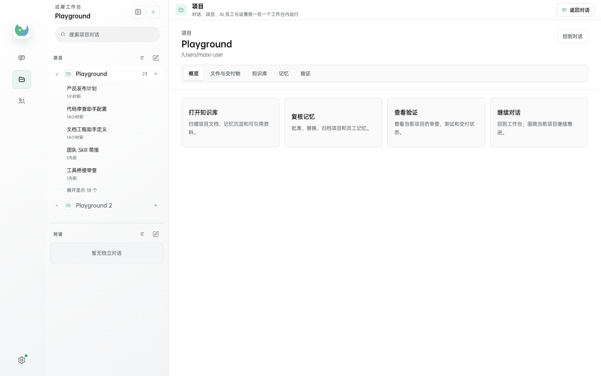
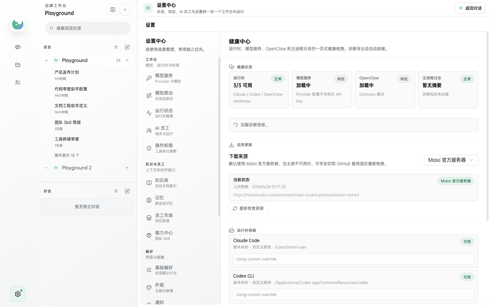

# Maixi Studio

<p align="center">
  
</p>

Maixi Studio 是一个面向项目工作的 AI 桌面工作台。它把对话、项目文件、AI 员工、知识库、长期记忆、交付记录和运行诊断放在同一个界面里，让用户可以从“登录账号”一路走到“选择项目、发起任务、追踪产物、沉淀知识”。

这个仓库是 Maixi Studio 的公开发布仓库，用于存放 GitHub 备用更新源和 release 资产。默认更新源仍然是 [maixistudio.cn](https://maixistudio.cn)，GitHub Releases 作为用户可手动切换的备用下载通道。

## 截图





## 当前版本

- 最新版本：`2.1.1`
- 默认更新源：`https://maixistudio.cn`
- GitHub 备用源：本仓库的 [Releases](https://github.com/maixi-studio/maixi-studio-releases/releases/latest)
- 当前公开产物：macOS Apple Silicon / arm64

> Windows x64 的发布流程已预留，但只会在 Windows x64 实机完成安装、登录、初始化、更新和卸载保留用户数据验证后发布。

## 下载

- 官网下载：[maixistudio.cn](https://maixistudio.cn)
- macOS arm64 DMG：[Maixi-Studio-2.1.1-arm64.dmg](https://maixistudio.cn/downloads/maixi-studio/Maixi-Studio-2.1.1-arm64.dmg)
- GitHub 最新 Release：[v2.1.1](https://github.com/maixi-studio/maixi-studio-releases/releases/latest)
- 校验文件：[SHA256SUMS.txt](https://maixistudio.cn/SHA256SUMS.txt)

## 核心能力

- 对话工作台：围绕项目推进会话，保留任务过程、工具调用、交付物和重点记录。
- 项目空间：把文件、交付物、知识库、记忆和验证状态按项目组织。
- AI 员工：连接 OpenClaw 网关，查看可用员工、员工市场和运行状态。
- 知识库：扫描项目文档和已批准记忆，支持在输入栏引用项目知识。
- 长期记忆：以 canonical memory 为真相源，支持列表复核、归档、证据追溯和思维导图视图。
- 诊断与更新：支持 Maixi 官方服务器和 GitHub Releases 双更新源，允许用户检查、切换和重试。
- 公司账号：支持验证码登录、首次设置密码，以及管理员发放一次性 enrollment token。

## 发布规范

Maixi Studio 的 release 资产不手工改包、不复用旧版本号、不从 macOS 推断 Windows 可用性。每次发布至少需要完成：

- TypeScript 检查、单测、关键功能回归和 `git diff --check`。
- macOS 产物校验：ZIP-only `latest-mac.yml`、DMG、ZIP、blockmap、manifest、SHA256。
- 自动更新链路校验：官网 current feed、legacy feed、GitHub release feed。
- 登录与初始化 smoke：公司账号、模型路由、Secret Broker lease、项目选择、首条会话。
- 公开下载回读校验：上传后重新下载并比对 SHA256。

## 更新源说明

应用内默认使用 Maixi 官方服务器：

```text
https://maixistudio.cn/downloads/maixi-studio/updates/darwin-arm64/latest-mac.yml
```

当用户手动切换到 GitHub 备用源时，应用会读取本仓库最新 release 中的 feed：

```text
https://github.com/maixi-studio/maixi-studio-releases/releases/latest/download/latest-mac.yml
```

## 安全与隐私

- 个人 API Key 保存在系统密钥库中，不明文写入配置文件。
- 公司 Key 通过 Maixi Secret Broker 下发短期租约，客户端只持有必要引用。
- 诊断导出会自动脱敏 token、cookie、API Key 和本机用户路径。
- 启动页、模型列表和健康检查不会反复主动读取 Keychain；只有测试模型、发送消息、登录续期等明确动作会读取密钥。
